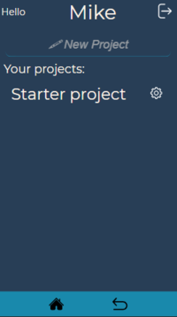
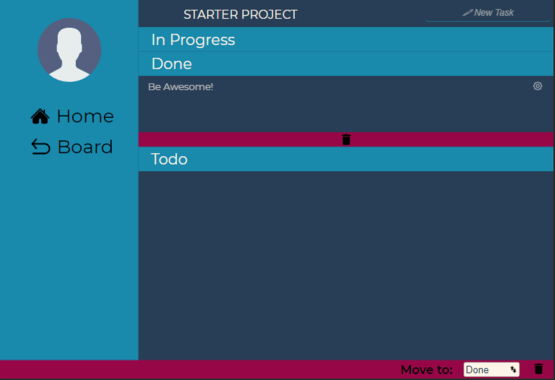
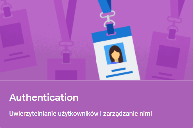

# EFFI


### Introduction

A simple too list is not enough for you, but you don't like complicated tools? We too!

Our motto is to be efficient. That's why we created EFFI.

We know how important mobility is, which is why our application looks great on smartphones.



But of course you can use it on any device



### 1. About EFFI

The application is based on the Firebase API from Google. The AUTH service gives us control over authorization,


and the FIRESTORE service allows us to save all user ideas!


Within the app, you can create so-called 'projects', with which you can break down a large task into individual small tasks and manage them!
Of course, you can have multiple projects at once.

When creating a new project, you immediately get three columns from us: TODO, IN PROGRESS and DONE with one completed task: Be Awesome! 😎. Don't feel limited! You can delete completed projects, unnecessary columns and completed tasks.

As part of a single project, e.g. preparing Christmas, you can have many lists, such as: items to buy, things to do, people to invite.


To meet the need, we used the `beautiful DnD` library - it is responsible for the possibility of changing the order of lists using the `drag and drop` method. Isn't that great?

We know how important mobility is, which is why our application looks great on smartphones. That's why we focused on smaller devices.

### 2. Features

- online application to tackle all of your work projects in one place
- portfolio view of all your projects
- personalized to-do lists
- you can use on any device
- drag and drop method on list's
- TOTALLY FREE

### 3. Instalation

You can install our app! Just clone the repository and run the command:

```
yarn install
```

That's all!

### 4. The future of the App

We plan to introduce further improvements in the near future.
We are going to introduce a user panel with the option of adding an avatar.
We're going to add the ability to select favorite or archived projects.

### License

Open Source.

### Authors:

1. [Małgorzata Nowak-Krawańska](https://github.com/malgonowak)
2. [Bogusław Wiktorko](https://github.com/BoguslawWiktorko)
3. [Wiktor Jagiełło](https://github.com/alistaireredwood)
4. [Adam Wódka](https://github.com/adamvodka)
